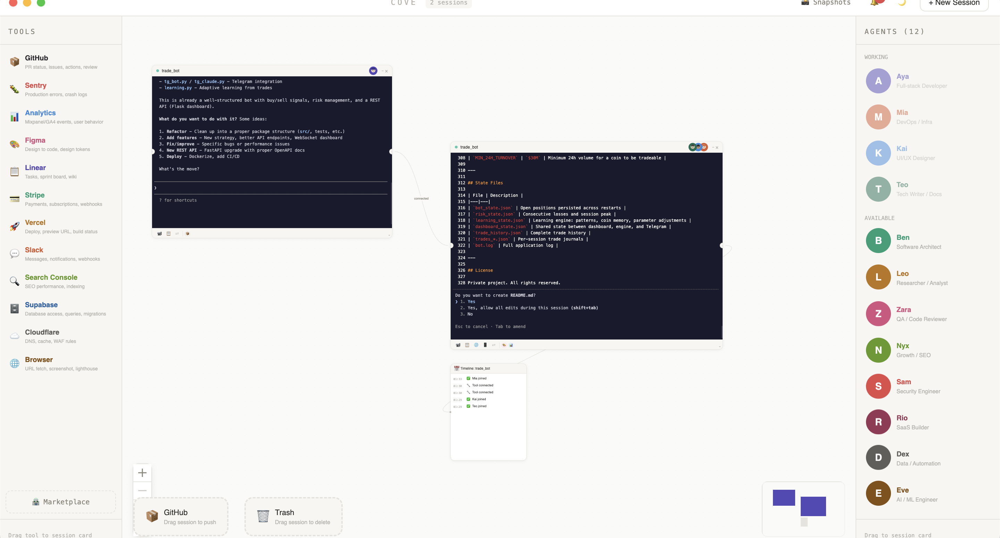
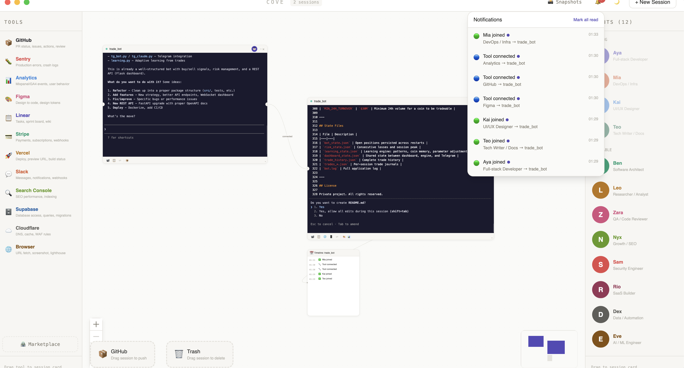

# Cove

**Spatial canvas for managing Claude Code sessions.**

FigJam meets terminal. Drag agents onto session cards, connect projects, watch AI teammates work side by side — on an infinite canvas.

> ⚠️ Alpha — things break. macOS only for now. PRs welcome.



---

## What is this?

Claude Code runs in a terminal. Multiple projects = multiple tabs. You lose track.

Cove replaces tabs with a spatial workspace. Every project is a card on a canvas. Every card has a real terminal inside. You see everything at once, connect related projects, and let AI agents work while you watch.

## How it works

```
Drag an agent onto a session card
  → Claude Code spawns with --append-system-prompt and --mcp-config
  → Terminal streams into xterm.js inside the card
  → You click the card, type, Claude responds
  → Token cost parsed from stream-json output
  → Preview cards spawn when localhost detected
```

## Screenshots

| Dark mode | Notifications |
|-----------|---------------|
|  |  |

## Features

### Working
- Spatial canvas — pan, zoom, grid, minimap (reactflow)
- Session cards with real terminals (xterm.js + node-pty)
- 12 agents with unique roles and system prompts
- Agent drag-drop onto cards (max 3 per card)
- Skill/tool drag-drop with MCP config generation
- Session connections with bezier edges
- Sticky notes (N key, 6 colors, checkboxes)
- Timeline card (event log from Claude Code hooks)
- Session recording (500ms batch, 10K event cap)
- Notification center (agent joined, tool connected, errors)
- Snapshots (save/restore canvas layout)
- Dark/light theme (Cmd+D)
- Keyboard shortcuts (Cmd+N, Cmd+S, N, ?)
- GitHub zone (drag session to push)
- Trash zone (drag session to delete, with confirmation)
- Persistence (session layout + agent assignments survive restart)
- Graceful PTY shutdown + spawn limits (max 8)

### Partially working
- Token tracking — parses stream-json but needs `--output-format` flag timing fix
- Preview cards — port detection works, health check runs, but iframe security needs hardening
- Marketplace — fetches from GitHub with cache fallback, install is UI-only (doesn't add real MCP config yet)
- MCP tools — 3 of 12 have verified server packages (GitHub, Supabase, Browser). Others have config but unverified npx packages

### Not yet implemented
- Session connection context sharing (.claude/connected-projects.md)
- Agent chat bubbles (inter-agent messaging)
- Agent expression changes (happy/sad/thinking)
- Card resize handles
- Cross-platform support (Windows, Linux)

## Agents (12)

| Agent | Role | Style |
|-------|------|-------|
| Aya | Full-stack developer | Fast prototyper, ships first |
| Ben | Software architect | Plans before coding |
| Mia | DevOps / Infra | Automates everything |
| Leo | Researcher / Analyst | Analyzes, compares, reports |
| Zara | QA / Code reviewer | Finds every edge case |
| Kai | UI/UX Designer | Pixel perfect, component-first |
| Nyx | Growth / SEO | Traffic, conversion, content |
| Sam | Security engineer | Audits everything, trusts nothing |
| Rio | SaaS builder | MVP in a day |
| Dex | Data / Automation | Pipelines, APIs, cron jobs |
| Eve | AI / ML engineer | Models, prompts, RAG |
| Teo | Tech writer / Docs | README, API docs, changelogs |

Each agent has a different `--append-system-prompt` passed to Claude Code at session start.

## Tools (12 MCP skills)

GitHub, Sentry, Analytics, Figma, Linear/Notion, Stripe, Vercel/Netlify, Slack/Discord, Search Console, Supabase, Cloudflare, Browser.

Drag a tool onto an agent or session card → MCP config JSON written to temp file → Claude Code launched with `--mcp-config` flag.

## Quick start

```bash
# Prerequisites: Node.js 18+, Claude Code CLI installed and authenticated
# Install CLI: npm install -g @anthropic-ai/claude-code
# Authenticate: claude login

git clone https://github.com/0xyrn/cove.git
cd cove
npm install
npm run dev
```

## Stack

| Layer | Tech | Version |
|-------|------|---------|
| Desktop | Electron | 31 |
| Frontend | React + TypeScript | 18 |
| Canvas | reactflow / xyflow | 12 |
| Terminal | xterm.js + node-pty | 5.x |
| State | Zustand (persisted) | 5 |
| Styling | Tailwind CSS | 3 |
| Build | electron-vite | 2 |
| AI | Claude Code CLI + MCP | latest |

## Architecture

```
electron/
  main.ts              — Electron main process, IPC handlers, PTY management
  preload.ts           — Context bridge (pty, mcp, app APIs)

src/
  App.tsx              — Root layout, keyboard shortcuts, new session modal
  store/store.ts       — Zustand store (sessions, agents, skills, notes, recordings, snapshots)

  components/
    canvas/Canvas.tsx         — reactflow wrapper, node/edge rendering
    session/SessionCard.tsx   — Main component: terminal + header + footer + agent avatars
    agents/AgentPanel.tsx     — Right sidebar: draggable agent list
    agents/AgentAvatar.tsx    — SVG mini-face avatars with status dots
    skills/SkillPanel.tsx     — Left sidebar: draggable tool list
    preview/PreviewCard.tsx   — Web/mobile/API preview with health checks
    notes/StickyNote.tsx      — Canvas sticky notes
    timeline/TimelineCard.tsx — Event log card
    recording/RecordingPlayer.tsx — Session playback
    notifications/NotificationCenter.tsx — Toast + panel
    marketplace/MarketplacePanel.tsx    — Community skills/agents browser
    ui/Toolbar.tsx            — Top bar: new session, snapshots, theme, notifications

  lib/
    mcpConfig.ts       — Builds MCP config JSON from assigned skills
  data/
    agents.ts          — 12 agent definitions (name, color, role, system prompt)
    skills.ts          — 12 skill definitions (name, icon, color, MCP config)
```

### Session lifecycle

```
User creates session (picks folder)
  → PTY spawned in Electron main process (node-pty, /bin/zsh -l)
  → xterm.js attached in renderer
  → User drags agent onto card
  → Claude Code launched: claude --append-system-prompt "..." --mcp-config "/tmp/..."
  → Terminal output streamed to xterm.js
  → Token usage parsed from output
  → Port detection regex scans output for localhost
  → Timeline events logged from notifications
```

## Known issues

- Token counter doesn't always increment (output parsing timing)
- `--append-system-prompt` command visible in terminal on first launch
- macOS only — node-pty and Electron paths are macOS-specific
- Preview shows URL + open button (no embedded iframe)
- Marketplace install button only updates UI state
- Recording playback timing can drift on long sessions
- PTY processes may leak if app is force-quit

## Keyboard shortcuts

| Key | Action |
|-----|--------|
| Cmd+N | New session |
| Cmd+S | Save snapshot |
| Cmd+D | Toggle dark/light |
| N | New sticky note |
| Esc | Close modals |
| ? | Show shortcut list |

## Roadmap

- [ ] Fix token tracking reliability
- [ ] Verify remaining MCP server packages
- [ ] Session connection context sharing
- [ ] Agent chat bubbles via Agent Teams API
- [ ] Card resize handles
- [ ] Agent expression changes
- [ ] Cross-platform support (Windows, Linux)
- [ ] Tauri port (lighter than Electron)

## Contributing

```bash
# Fork → branch → change → test (npm run dev) → PR
```

## License

MIT
