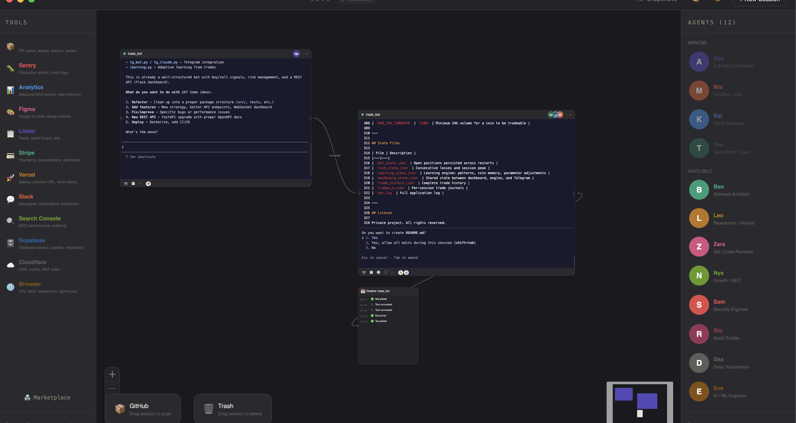

# Cove

A spatial canvas workspace for Claude Code. Think FigJam meets Terminal — every card is a live Claude Code session.



## What is this?

Cove turns Claude Code into a visual workspace. Instead of switching between terminal tabs, you work on an infinite canvas where each project is a card with a real terminal inside.

- **Session cards** = Claude Code terminals. Click and type, Claude responds.
- **Agents** = AI personas with different roles. Drag an agent to a card to set its behavior.
- **Tools** = MCP integrations (GitHub, Supabase, etc). Drag to a card to connect.
- **Connections** = Link related projects together.


## Features

**Core**
- Infinite canvas with pan, zoom, grid snap
- Session cards with embedded xterm.js terminals
- Claude Code auto-launch with `--append-system-prompt` and `--mcp-config`
- Multiple sessions running simultaneously

**Agents (12)**
Drag any agent to a session card. Each has a unique role and system prompt:

Aya (Full-stack) · Ben (Architect) · Mia (DevOps) · Leo (Researcher) · Zara (QA) · Kai (UI/UX) · Nyx (Growth/SEO) · Sam (Security) · Rio (SaaS Builder) · Dex (Data/Automation) · Eve (AI/ML) · Teo (Tech Writer)

**Tools (12 MCP integrations)**
GitHub · Sentry · Analytics · Figma · Linear · Stripe · Vercel · Slack · Search Console · Supabase · Cloudflare · Browser

**Canvas objects**
- Sticky notes (press `N`) with 6 colors
- Timeline cards showing session event history
- Preview cards (web/mobile/API) with port auto-detection
- Recording + playback of terminal sessions
- Connections between cards with labels

**Workspace**
- Dark / light theme toggle (`Cmd+D`)
- Snapshots — save and restore canvas layouts (`Cmd+S`)
- Notifications center with event tracking
- Token / cost tracking per session
- GitHub zone (drag card to push) + Trash zone (drag to delete)
- Marketplace for community tools and agents
- Keyboard shortcuts (`Cmd+N`, `Cmd+0`, `N`, `?`, `Esc`)


## Quick start

```bash
git clone https://github.com/0xyrn/cove.git
cd cove
npm install
npx electron-rebuild -f -w node-pty
npm run dev
```

Requires: Node.js 20+, Claude Code CLI installed (`~/.local/bin/claude`)

## How to use

1. Click **+ New Session** — pick a project from your Claude history or enter a path
2. Drag an **agent** from the right panel onto the card
3. Claude launches with the agent's personality. Type in the terminal.
4. Drag **tools** from the left panel onto the card for MCP integrations
5. Connect cards by dragging from one handle (○) to another
6. Right-click cards for more options (preview, timeline, quick tasks)

## Stack

Electron · React · TypeScript · Vite · reactflow · xterm.js · node-pty · Zustand · Framer Motion · Tailwind CSS

## License

MIT
